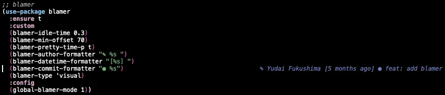

この記事は [Emacs Advent Calendar 2022](https://qiita.com/advent-calendar/2022/emacs) 17日目の記事です。  


## はじめに

VS Code を使ったことがある方なら誰しも一度は使用したことがあるであろうパッケージに [GitLens](https://gitlens.amod.io/) があります。  
これは、簡潔に言うとカーソルのある現在行や、クラスの先頭に Git Blame の情報を表示してくれるものです。  
以下に、VSCode での使用例を貼っておきます。  


[Blamer.el](https://github.com/Artawower/blamer.el) は Artawower さんによって作成された Emacs 用の Git Blame プラグインです。  

> A git blame plugin for emacs inspired by VS Code’s GitLens plugin and Vim plugin  

とあることからもわかるように、VSCode の GitLens や Vim の [Blamer.nvim](https://github.com/APZelos/blamer.nvim) プラグインと似た機能を持っています。  

日本語での記事が見当たらなかったため、この記事で軽く触れて行けたらと思っています。  


## 設定例

最初に自分が使用している設定例を載せておきます。  

```emacs-lisp
(use-package blamer
  :ensure t
  :custom
  (blamer-idle-time 0.3)
  (blamer-min-offset 70)
  (blamer-pretty-time-p t)
  (blamer-author-formatter "✎ %s ")
  (blamer-datetime-formatter "[%s] ")
  (blamer-commit-formatter "● %s")
  (blamer-type 'visual)
  :config
  (global-blamer-mode 1))
```

実際の使用感は次のようになります。  



カーソルのある行のコミット情報が表示されていることがわかると思います。  

## 説明

さらっと設定に触れていきます。  

-   Git Blame の情報を表示するまでにかかる秒数の設定  
    `(blamer-idle-time)` にて設定することができます。  

-   表示する際の著者・時刻・メッセージのフォーマットの設定  
    ```emacs-lisp
    (blamer-author-formatter "✎ %s ")    ;; 「✎ 著者名」と表示される
    (blamer-datetime-formatter "[%s] ")  ;; 「[コミット作成日時] 」と表示される
    (blamer-commit-formatter "● %s")     ;; 「● コミットメッセージ」 と表示される
    ```
    コミット作成者・作成日時・コミットメッセージの表示フォーマットを設定することができます。  
    さらに、コミット作成日時に関しては、 `(setq blamer-pretty-time-p t)` とすることでいい感じにしてくれます。  

-   コミット情報を表示するまでのオフセットの設定  
    `(blamer-min-offset)` にて設定することができます。  
    以下にオフセットを 10 に設定した場合の画像を貼っておきます。  
    
	

-   コミット情報の表示方法の設定  
    `(blamer-type)` にて設定することができ、次の 5 パターンの表示方法があります。  
    
    1.  `selected` : マークされた各行に対してのコミット情報を表示します。  
        
		
    
    2.  `visual` : カーソルがある現在行のコミット情報を表示します。   
        
		
    
    3.  `both` : `selected` と `visual` 両方で情報を見ることが出来ます。
    
    4.  `overlay-popup` : 名前の通りです。 `overlay-popup` の場合は、表示位置を上下選ぶことができます。
    
    5.  `posframe-popup` : 同じく名前の通りです。
    
    4, 5 に関しては、[公式から画像](https://github.com/Artawower/blamer.el/tree/master/images) が提供されています。  
    	  また、 `selected` の場合、 `blamer-max-lines` で表示する最大行数を設定することもできます。   

-   `blamer-show-commit-info`  
    `M-x blamer-show-commit-info` でコミット情報を表示することができます。  
    
	

他にも、 `uncommitted changes` の表示メッセージを変更できたり、コミット上にマウスを置いた際に、ツールチップを表示させたり等、もっと多くのことができます。  


## まとめ

Emacs 用の GitLens パッケージ Blamer.el を紹介しました。  
良い Emacs ライフを！  


## 参考リンク

-   [Artawower/blamer.el (GitHub)](https://github.com/Artawower/blamer.el)
-   [自分の設定ファイルへのリンク (GitHub)](https://github.com/granddaifuku/.emacs.d/blob/9a74af0a088d3d051ec78d61a93bb8c5124dc270/init.el#L635)

