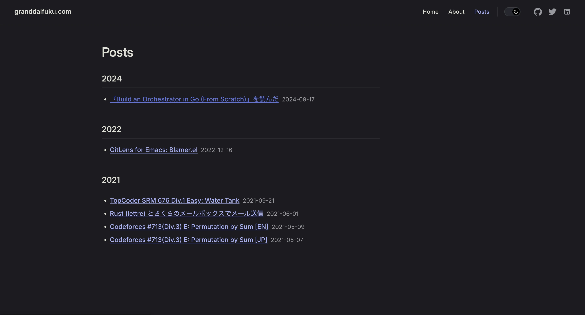

## モチベーション

元々、[astro](https://astro.build/) を使って自分の website を作成していた。

1. 定期的にやってくるフレームワークを見直したい欲
2. Built-in theme が欲しいと言う気持ち
3. 基本的には、markdown を作成すれば良いようにしたい

というあたりが動機となって使っているフレームワークを [VitePress](https://vitepress.dev/) に移行した

最近使う機会がある、Vue.js + Vite の組み合わせにも惹かれた部分が少しある。

## Steps

公式の Getting Started ページを参考に進める。[ref](https://vitepress.dev/guide/getting-started)

1. `pnpm add -D vitepress@next` で devDependencies に vitepress を追加
2. Setup Wizard を起動

```shell
❯ pnpm vitepress init

┌  Welcome to VitePress!
│
◇  Where should VitePress initialize the config?
│  ./
│
◇  Where should VitePress look for your markdown files?
│  ./
│
◇  Site title:
│  granddaifuku.com
│
◇  Site description:
│  Yudai Fukushima's personal website
│
◇  Theme:
│  Default Theme
│
◇  Use TypeScript for config and theme files?
│  Yes
│
◇  Add VitePress npm scripts to package.json?
│  Yes
│
◇  Add a prefix for VitePress npm scripts?
│  Yes
│
◇  Prefix for VitePress npm scripts:
│  docs
│
└  Done! Now run pnpm run docs:dev and start writing.

❯ ls
api-examples.md  index.md  markdown-examples.md  node_modules  package.json  pnpm-lock.yaml
```

あとは、公式ページを参考に好きに設定していくだけ。

## エントリ一覧を表示する

posts ディレクトリ配下にブログなどを載せていく事にした。公式でデータローダが用意されているのでそれを利用する。[ref](https://vitepress.dev/ja/guide/data-loading#createcontentloader)

```typescript
// .vitepress/loader/posts.data.ts
import { createContentLoader } from "vitepress";

const CONTENTS_PATH = "posts/**/*.md";

export default createContentLoader(CONTENTS_PATH, {
  includeSrc: false,
  transform(rawData) {
    return rawData
      .filter((post) => !post.frontmatter.draft && !post.url.endsWith("/posts/"))
      .sort((a, b) => {
        return new Date(b.frontmatter.date).getTime() - new Date(a.frontmatter.date).getTime();
      });
  },
});
```

記事の公開年ごとに一覧を表示している

```markdown
<!-- posts/index.md -->
<script setup lang="ts">
import { data as posts } from "../.vitepress/loader/posts.data.ts";
  
const postsByYear = posts.reduce((acc, post) => {
  const year = new Date(post.frontmatter.date).getFullYear();
  
  if (!acc[year]) {
    acc[year] = [];
  }
  
  acc[year].push(post);
  
  return acc;
}, {});

const sortedYears = Object.keys(postsByYear).sort((a, b) => b - a);

function formatDate(dateString: string): string {
  return dateString.split('T')[0];
}

</script>

# Posts

<div class="posts-by-year">
<div v-for="year in sortedYears" :key="year" class="year-section">

### {{ year }}

<ul class="posts-list">
<li v-for="post in postsByYear[year]" :key="post.url" class="post-item">
<a :href="post.url">{{ post.frontmatter.title }}</a>
<span class="post-date">{{ formatDate(post.frontmatter.date) }}</span>
</li>
</ul>

</div>
</div>
```

こんな感じ



## 余談

ローカル環境に Node.js なり諸々をインストールしたくないので、Docker コンテナを立ててその中で開発をしている

```Dockerfile
FROM node:25.2.1-slim

RUN npm install -g pnpm@10.26.2

WORKDIR /app

COPY package.json pnpm-lock.yaml ./
RUN pnpm install --frozen-lockfile
```

これを使って

1. `docker image build -t vitepress-dev:latest .` で、vitepress-dev という docker image を作成
2. `docker run -it --rm -p 5173:5173 -v .:/app -v /app/node_modules vitepress-dev:latest /bin/bash` で

- ホストの 5173 ポートにコンテナの 5173 ポートをフォワーディング (-p 5173:5173)
- カレントディレクトリをマウント (-v .:/app)
- 匿名ボリュームの作成 (-v /app/node_modules)
- bash シェルの起動

をしている。

その後シェル上で、

```shell
❯ pnpm docs:dev --host

> @ docs:dev /app
> vitepress dev --host


  vitepress v2.0.0-alpha.15

  ➜  Local:   http://localhost:5173/
  ➜  Network: http://192.168.215.2:5173/
  ➜  press h to show help

  Shortcuts
  press r to restart the server
  press u to show server url
  press o to open in browser
  press c to clear console
  press q to quit
```

ローカルマシンから、`localhost:5173`にアクセスをすると開発中のサイトが見られるようになる。

## 参考

- [VitePressをブログサイトとして使う](https://zenn.dev/920oj/articles/5f5f9e6e6d4011)
- [VitePressでブログを作ってみました](https://blog.hakuteialpha.com/posts/vitepress-blog/#%E8%A8%98%E4%BA%8B%E3%83%AA%E3%82%B9%E3%83%88%E3%82%92%E4%BD%9C%E6%88%90%E3%81%99%E3%82%8B)
- [ブログサイトを VitePress へ移行した](https://nshmura.com/posts/migration-to-vitepress/)
- [VitePress: Getting Started](https://vitepress.dev/guide/getting-started)
